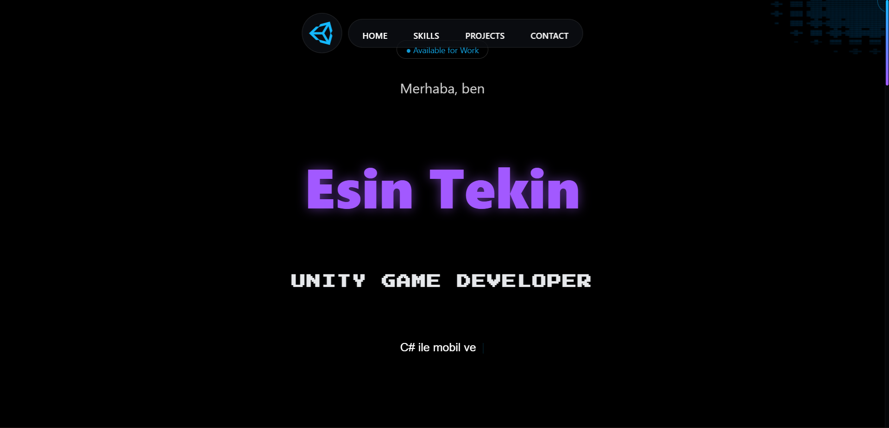
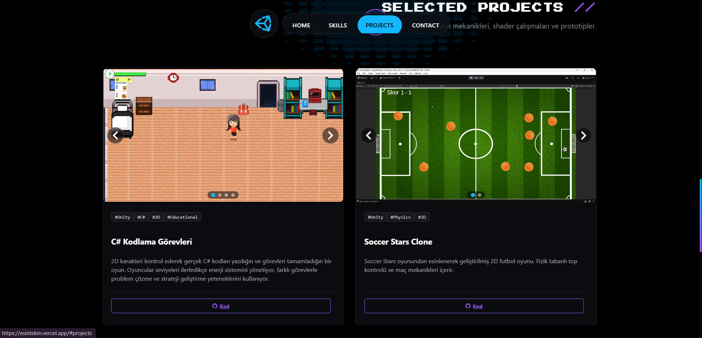

# 🎮 Unity Game Developer Portfolio

*Canlı Demo:* [https://esintekin.vercel.app/](https://esintekin.vercel.app/) 🚀

Modern, yüksek performanslı ve "Cyberpunk/Game Dev" estetiğine sahip, *React* ve *WebGL* teknolojileriyle geliştirilmiş profesyonel portfolyo web sitesi.

## ✨ Özellikler

Bu proje, standart bir web sitesinden ziyade bir *oyun arayüzü (UI)* hissiyatı vermek üzere tasarlanmıştır:

* *⚡ Ultra Performans:* WebGL (OGL) tabanlı arka plan efektleri, mobil cihazlar için optimize edilmiştir.
* *🎨 Cyberpunk & Glitch Teması:* Özel piksell fontlar, neon efektler ve "Faulty Terminal" arka planı.
* *🎥 Hibrit Slider:* Proje kartlarında hem resim hem de video (mp4) oynatabilen özel Carousel yapısı.
* *📱 Tam Responsive:* clamp() fonksiyonları ile her ekran boyutuna (Mobil, Tablet, PC) mükemmel uyum.
* *🔊 Ses Efektleri:* Menü ve buton etkileşimleri için özel SFX (Game Feel).

## 🛠 Teknolojiler

* *Core:* [React](https://react.dev/) + [Vite](https://vitejs.dev/)
* *Styling:* Modern CSS (Glassmorphism, Grid Layout)
* *Animations:* [Framer Motion](https://www.framer.com/motion/), [GSAP](https://gsap.com/)
* *WebGL:* [OGL](https://github.com/oframe/ogl) (Performanslı 3D arka plan için)
* *Icons:* [React Icons](https://react-icons.github.io/react-icons/)

## 🚀 Gelişmiş Animasyonlar

* *Preloader:* "System Initializing" tarzı sinematik açılış ekranı.
* *Scroll Reveal:* Aşağı kaydırdıkça bulanıktan netleşen içerikler.
* *Text Effects:* BlurText, GlitchText, Shuffle ve Typewriter efektleri.
* *Custom Cursor:* Oyun hissi veren, etkileşimli özel mouse imleci.

## 📦 Kurulum ve Çalıştırma

Projeyi yerel makinenizde çalıştırmak için şu adımları izleyin:

1.  *Depoyu Klonlayın:*
    bash
    git clone [https://github.com/esnnt/unity-portfolio.git](https://github.com/esnnt/unity-portfolio.git)
    cd unity-portfolio
    

2.  *Bağımlılıkları Yükleyin:*
    bash
    npm install
    

3.  *Geliştirme Sunucusunu Başlatın:*
    bash
    npm run dev
    

4.  Tarayıcınızda http://localhost:5173 adresine gidin.

Proje, ölçeklenebilir ve temiz bir mimari ile kurgulanmıştır:

## 📂 Dosya Yapısı (Feature-Based)

src/
│
├── components/            # Tekrar kullanılabilir UI bileşenleri
│   ├── common/            # Ortak kullanılan küçük bileşenler
│   ├── layout/            # Sayfa düzeni bileşenleri (Navbar, Footer vb.)
│   └── ui/                # Özel efektler (GlitchText, FaultyTerminal, CustomCursor)
│
├── data/                  # Proje ve yetenek verileri (JSON formatında)
│
├── features/              # Sayfa bölümleri (Hero, Skills, Projects, Contact)
│
├── hooks/                 # Custom Hooks (örn. useUISound)
│
├── App.jsx                # Ana düzen + Global efektlerin yönetimi
│
└── index.css              # Global stiller + Responsive ayarları

* *Projeler:* src/data/projects.js (Başlık, açıklama, resim/video yolları)
* *Yetenekler:* src/data/skills.js (İkonlar ve seviyeler)
* *İletişim:* src/features/contact/Contact.jsx (Sosyal medya linkleri)

## 🤝 Katkıda Bulunanlar

* *Development:* Mehmet Sönmez [(https://github.com/mehmet2725)]
* *Design & Content:* Esin Tekin 
